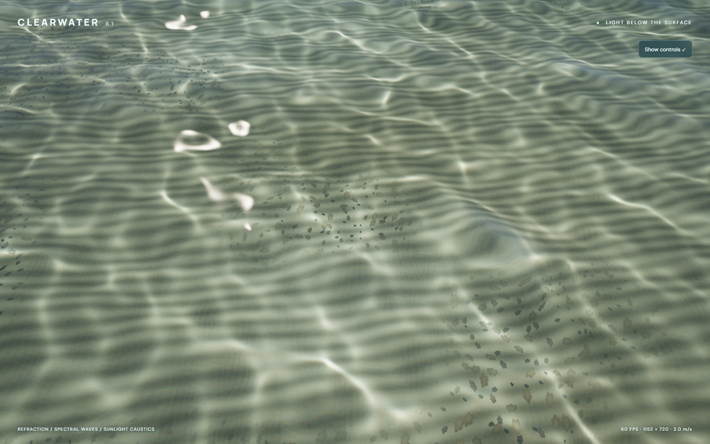

# ClearWater6.1

[Live demo](https://samg-coder.github.io/ClearWater6.1/) ? [Build and deployment](https://github.com/SamG-Coder/ClearWater6.1/actions/workflows/pages.yml)



An original CUDA WebShader water study with FFT waves, clear shallow-water refraction, sunlight caustics, a procedural seabed, and a GPU-resident fly camera. The water code was written for this project; it does not use Clearwater or other demo source. Only the CUDA WebShader compiler and runtime are vendored from [CUDA WebShader](https://github.com/SamG-Coder/cuda-webshader) under its MIT license.

## Run

```powershell
npm install
npm run build
npm start
```

Open http://127.0.0.1:5191 in a browser with WebGPU enabled. `npm run build` compiles every kernel ahead of time, so the browser loads generated artifacts rather than recompiling CUDA source. `dist/` is a standalone static site, including the CUDA source and runtime.

## Explore

Hold the left mouse button and drag across the water to apply force. Right-drag to look, or click **Fly camera** to capture the mouse. **WASD** flies in the viewing direction; **Q/E** lowers/raises the camera; **Shift** boosts speed. Scroll changes speed. **Esc** releases the mouse. Arrow keys look, **H** hides the panel, and **Reset** restores the shallow-water view. The camera stays above the surface; this is an above-water water study.

Depth, wave energy, wind, exposure, and render resolution are adjustable. **Shallows** and **Open water** set depth, wave energy, and camera presets. The caustic and normal views expose the rendering components.

## CUDA implementation

All simulation, camera integration, ray generation, lighting, seabed materials, optics, tone mapping, and pixel packing live in `src/water.cu`. JavaScript handles input events, UI, resource creation, dispatches, and copying the GPU output to the canvas. There are no downloaded textures, Three.js, WebGL, or handwritten WGSL shaders in the water implementation.

- Two deterministic 128 × 128 complex spectral cascades span 6 m and 96 m. A wind-aligned Phillips-style spectrum evolves with finite-depth gravity-wave dispersion, `omega² = g k tanh(k depth)`.
- Hermitian spectra and a separable radix-2 inverse FFT produce real heights. Resolved finite differences produce normals. The deliberately unnormalized inverse FFT uses source amplitudes calibrated in world units.
- The renderer intersects the height field and refracts view rays using water's refractive index. Rays intersect a gently undulating procedural seabed with sand ripples and scattered stones.
- Fresnel reflection, per-channel Beer-Lambert absorption, water scattering, and sun highlights shade the surface.
- A 256 × 256 sunlight map follows refracted rays to the mean-depth plane and estimates the photon mapping Jacobian. Area compression produces caustic focusing, with slightly different RGB indices of refraction. The map follows the short-wave cascade; the long cascade contributes surface shape and normals. This keeps the caustic tile periodic and bounded in cost.
- A moving left-button drag is projected onto the water on the GPU. A Gaussian pressure path injects vertical velocity into a third complex spectral field, evolved with an analytic damped gravity-wave oscillator before the same inverse FFT. The wake changes surface height, normals, reflection and view-ray refraction, and persists after release. Stationary clicks and hover inject no force. The caustic photon map uses the background short-wave cascade; it does not include the interaction cascade. Interaction waves repeat every 24 m.
- Camera state remains in a GPU buffer. CPU inputs supply motion and look axes. The live frame loop never downloads camera, simulation, or pixel buffers.

This is a height-field approximation. It has no overturning breakers, underwater camera, shoreline wetting, or volumetric multiple scattering. Forward photon transport accumulates overlapping refracted rays; the finite light-map resolution bounds the smallest visible caustic features. Spectral fields repeat at their patch lengths, and the caustic tile repeats every 6 m.

## Validation

Start the local server, then run `npm test`. Run `npm run test:force` to exercise actual held mouse drags, hover and stationary-click negative controls, persistent wakes, and right-drag camera controls. Browser checks cover a direct complex Fourier-series oracle on four known modes, Hermitian residual, finite heights and lighting, a flat-water caustics negative control, changing image output over time, GPU camera movement, zero readbacks during live rendering, and full-compute GPU timestamp measurements at balanced resolution and 1080p. Screenshots and numerical results are written to `captures/`.

`waterLab` exposes `inspect()`, `fftTest()`, `flatCausticsTest()`, `seek(seconds)`, `benchmark(samples)`, `pause()`, and `resume()` for explicit diagnostics. Readbacks occur only when these inspection functions are requested. GPU timings include camera integration, spectrum evolution, FFT, normals, caustics, and rendering; they exclude the final texture copy and browser display. They are not an end-to-end FPS guarantee.

The browser executes CUDA-subset source compiled to WGSL on WebGPU. This project has not been validated as a native CUDA executable.

## GitHub Pages

Pushes to `main` run JavaScript syntax checks, compile all fourteen CUDA kernels into WebGPU artifacts, build the static site, and deploy `dist/` to GitHub Pages. Pull requests run the build without deploying. The workflow supports manual runs. Hosted Actions performs compilation and packaging; hardware WebGPU browser tests are run locally with `npm test` and `npm run test:force`.

## License

MIT. See [LICENSE](LICENSE) and [third-party notices](THIRD_PARTY_NOTICES.md).

## Mobile

Touch devices automatically select **Mobile / Auto** and start with the settings panel closed. The profile targets 30 rendered frames per second and limits the longest render edge to 960 pixels. Sustained slow frame completion reduces resolution automatically, down to half scale; recovered performance gradually restores it. High phone pixel ratios cannot multiply the render workload without a limit. Simulation and camera/lighting/render math remain in CUDA.

The mobile sunlight pass uses 256 × 256 rays and a single water index of refraction rather than the desktop 512 × 512 RGB ray set. It keeps focused caustics while reducing photon splat work by a factor of twelve. The 256 × 256 light map, all three 128 × 128 FFT fields, force propagation, refraction, and seabed remain enabled. Random wind spectra are generated once and rebuilt only when wind changes. Kernel artifacts download concurrently. Rendering pauses while the page is hidden, and touch cancellation clears movement inputs.

Screen footprint controls the fine sand grain, gravel visibility, and sunlight highlight width, suppressing subpixel shimmer while preserving nearby detail. Short-wave displacement and normals fade together in the distance to stabilize the horizon. Distant gravel searches are skipped once their detail cannot be resolved.

Phones start in **Mode: Look**: drag anywhere on the water to look around. The left **MOVE** joystick controls forward/backward and sideways flight and works while another finger drags to look. It has analog speed, a center dead zone, and automatic centering on release/cancellation. The − / + buttons lower or raise the camera. Switch to **Mode: Water** to apply force by dragging. Open **Settings** for water, wind, exposure and resolution controls. Desktop mouse and keyboard controls are also available.

Run `npm run test:mobile` with the local server running. The test uses browser touch events in Pixel 7 and iPhone 13 viewport emulation and checks force injection, look/flight controls, touch cancellation, orientation resizing, spectrum caching, and illumination normalization. The iPhone layout supports screen safe areas in portrait and landscape. This does not emulate a phone GPU, thermal throttling, or battery use. Physical Android/iPhone performance and Safari rendering remain unverified. A WebGPU-capable browser/device is required; this project has no WebGL fallback. Safari 26 introduced WebGPU on iPhone; older Safari versions cannot run this renderer. Use the HTTPS Pages link on a phone.

## Optimization without reducing quality

The 128² FFTs now use two shared-memory axis passes rather than fourteen global-memory stages. Cached twiddle factors preserve the same spectrum. Camera basis vectors are calculated once per frame, untouched force coefficients skip oscillator math, and a conservative gravel bound skips stones whose original coverage is exactly zero. Fixed lighting powers use float multiplication chains instead of the compiler runtime's software double-precision integer-power path. Resolution, FFT dimensions, sunlight ray count, and filtered caustics are unchanged.

Run `npm run test:optimization` with the server running. It compares mobile frames against this project's own published commit `ffeb5a0`, checks independent Fourier oracles for both FFT implementations, benchmarks the same resolution, and checks that slow displayed FPS is not clamped to ten. The mobile comparison now requires every pixel channel to match exactly. Desktop regression comparisons select one sample so that intentional PC supersampling changes do not hide other regressions. Desktop timings do not predict Samsung A34 FPS.

Depth-dependent dispersion and force envelopes are now cached and refreshed only when depth changes. Height-only intersection queries avoid evaluating unused slopes; underwater pixels skip unused direct-sky shading. Positive lighting powers use native float log2/exp2 math, so the render shader contains no software double-precision helpers. Mobile photons occupy a tightly packed single-channel working region, and the tent filter reads a shared 10×10 tile per 8×8 workgroup (100 global reads instead of 576). Compute and canvas transfer share one command submission. These changes retain the same resolution, FFT dimensions, ray count, filter weights, and shading parameters.

To choose an older baseline, set `WATER_REFERENCE_COMMIT` before running `npm run test:optimization`. The script also checks high-wind shallow water and low-wind deep water. Reference sources come only from this repository's own Git history.
The frequency cache uses packed float arrays (320 KiB), so background frequency reads are contiguous rather than padded float4 records. The force field is exactly zero before the first water drag; its FFT and oscillator dispatches are deferred until that drag. All three full-size fields remain allocated, and after activation the force field continues evolving every frame, including after release. No decay threshold or reduction in wave detail is used.

The latest math reuse pass shares the surface/view dot product between Fresnel, reflection and refraction, the distance fade between normals and caustics, the pixel footprint between seabed filtering and highlights, and the vertical refraction denominator across bed intersections. Gravel outlines reuse one angular calculation. The existing GPU camera kernel computes depth-only optical attenuation once per frame in spare basis components, without another allocation or dispatch. Against `dbfa572`, six reference scenes were byte-identical. At 448 × 912 on desktop NVIDIA/Edge, 80 samples measured median GPU compute time of 0.060448 ms before and 0.059648 ms after (about 1.3% lower); this modest result is not a physical-phone benchmark.

The next bandwidth pass skips all five bilinear pressure-field queries per water pixel until the first force gesture, then immediately uses the full field and continues its waves after release. Surface intersection and normal arithmetic are unchanged. Rendering uses 32 × 2 groups instead of 8 × 8, keeping 64 lanes while improving horizontal pixel access. Six reference frames against `630da51` remained byte-identical; a sky drag additionally checks that activating a zero pressure field leaves pixels unchanged. At 448 × 912, desktop NVIDIA/Edge median compute time measured 0.059552 ms before and 0.052096 ms after (12.5% lower). Two alternating 400-sample experiments measured the strip layout at 0.051968–0.052064 ms versus 0.053376 ms for square groups with the same skipped-pressure shader. These are desktop measurements; the skipped-field benefit applies before the first force gesture, while strip layout applies throughout. No resolution, ray count, material, or simulation fidelity was reduced.

Mobile lighting now stores one float per resolved texel and allocates only the single-channel photon working region. Together these buffers use 524,304 bytes (512 KiB plus a 16-byte inactive RGB binding), down from 2 MiB. The renderer interpolates monochrome light once and expands the result to RGB; desktop still uses full RGB dispersion. Buffer bindings are replaced when switching profiles, and flat-water diagnostics use isolated photon buffers. Random-cell normalization uses exact binary scaling by 2^-24; supported photon normalizations use native division by powers of two. Sun-disk powers are skipped below a .99 direction dot product, where their value is already below the float range. Seven scenes, including a camera aimed at the sun, matched the preceding release byte for byte. The mobile viewport benchmark measured 0.052256 ms before and 0.048512 ms after (7.2% lower median GPU compute time on desktop NVIDIA/Edge). A shared photon-sampling tile was tested and discarded because repeated runs were slightly slower. Set `WATER_DESKTOP=1` before running `npm run test:optimization` to also check the full RGB profile; actual phone performance remains unmeasured locally.

The same seven scenes were also byte-identical in the full RGB desktop profile at 1152 × 720. Its median compute time measured 0.125120 ms before and 0.118176 ms after. Mobile tests additionally verify the 524,304-byte lighting allocation, both profile-switch directions, flat-water energy conservation, joystick/screen-look input, cancellation, and persistent pressure waves.

PC quality now uses four fixed spatial samples per output pixel in Balanced, 1080p, 1440p, and 4K modes. Each sample evaluates the water/refraction/material shading with the correct half-pixel footprint, and their linear radiance is averaged before tone mapping. This improves fine-detail sampling and edge antialiasing without temporal blending. Performance and Mobile modes retain one center sample. Four-sample rendering uses the existing render dispatch and output buffer; FFT and lighting passes still run once per frame. Run `npm run test:pc` for before/after screenshots, sampling-mode checks, unchanged simulation/light checks, and GPU timings. Its desktop NVIDIA/Edge run at 1152 × 720 measured approximately 0.12 ms for one sample and 0.32 ms for four; compute timings exclude canvas transfer/display and do not guarantee every PC reaches 60 FPS. Zero-result highlight/gravel guards were tested but omitted because they gave no reliable speedup. Mobile output remains byte-identical in the seven reference scenes. `waterLab.setPixelSamples(0|1|4)` is an explicit diagnostic override; 0 restores automatic selection and Mobile always remains single-sample.

The PC multisample path has a separate `render_pc` entry point. Mobile and Performance dispatch the one-sample `render` shader, which excludes the PC sampling loop. Both reuse the same CUDA shading and pixel-packing functions, and each frame still has one render dispatch and one command submission.

PC quality verification also sets the actual GPU framebuffer to 2560 × 1440 and 3840 × 2160, confirms those dimensions and four spatial samples, and records 120 GPU timing samples plus 40 live frame-completion samples at each resolution. The completion measurement includes JavaScript encoding and the canvas copy through GPU completion, but excludes physical display latency. High-resolution screenshots are saved in `captures/`.

At actual 2560 × 1440 with four samples, 120 samples measured 1.148448 ms median / 1.274784 ms p95 GPU compute. At 3840 × 2160, they measured 2.481984 ms median / 2.789152 ms p95. Forty live frame-completion samples measured 3.3 / 4.0 ms at 1440p and 3.8 / 4.4 ms at 4K (median / p95), with approximately 60 Hz frame scheduling. These fixed-time shallow-water measurements used desktop NVIDIA Blackwell with Edge; they are not physical-phone results or universal PC FPS guarantees. Resolution choices cap render width at the selected value and the viewport physical width, so use fullscreen on a matching display to render at the full selected resolution.
